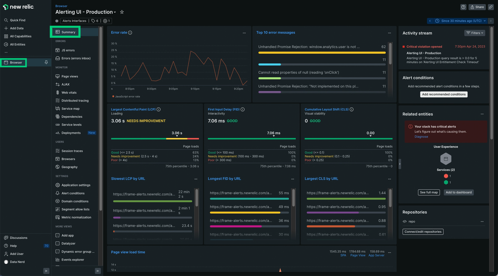
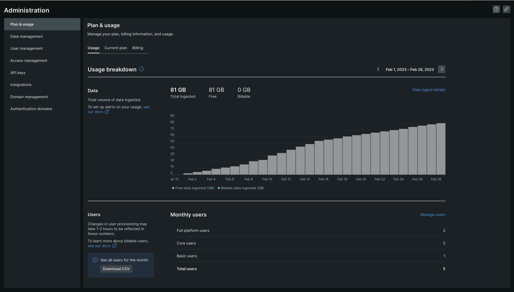
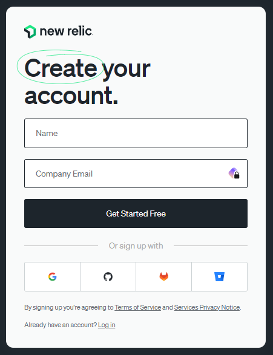
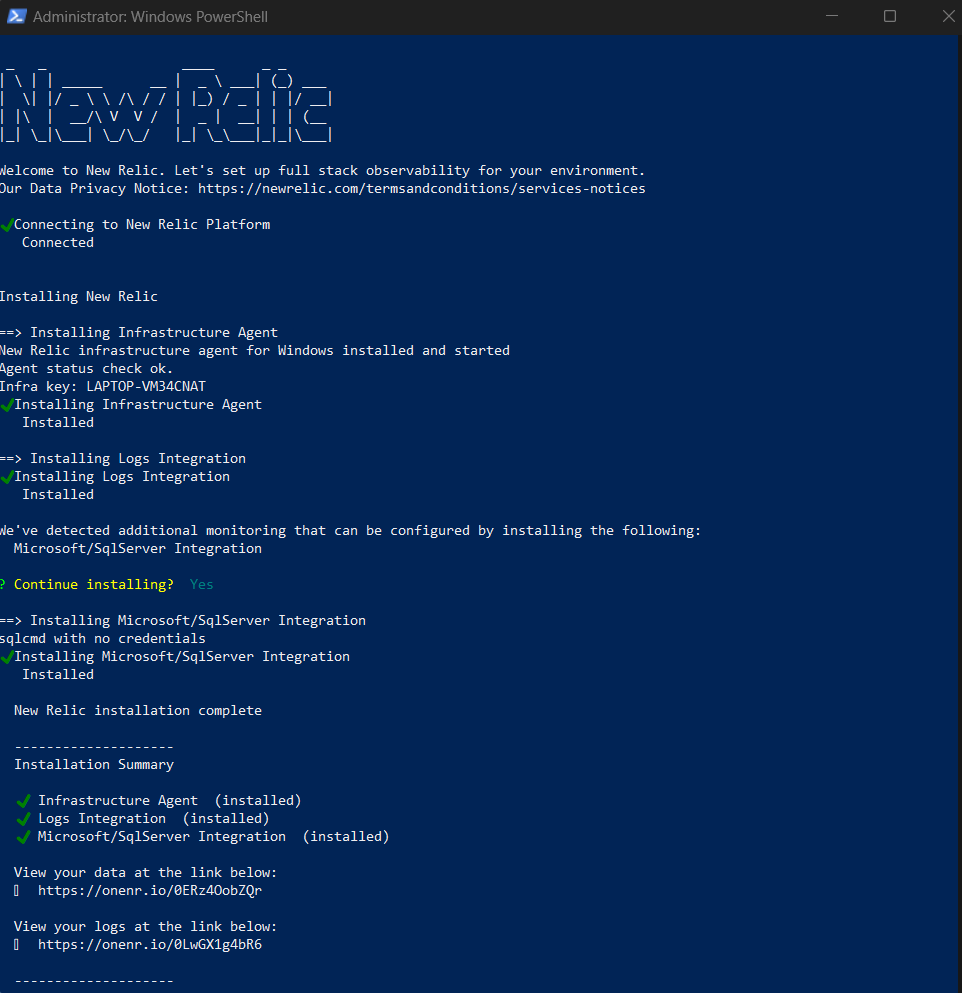
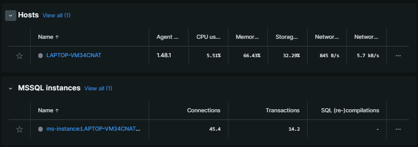
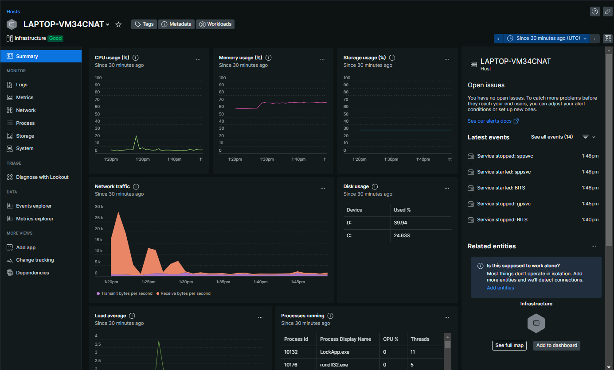
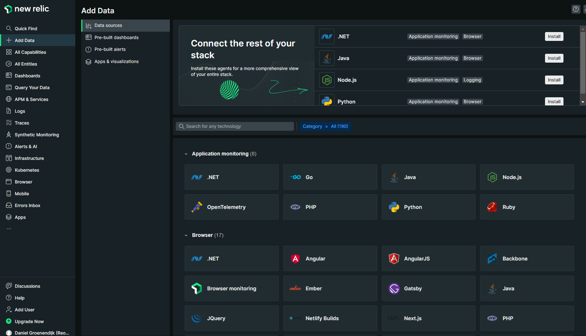

# Monitoring met New Relic

*Daniël Groenendijk*, oktober 2023

Een van de voornaamste voordelen van het gebruik van Kubernetes binnen een applicatie is de mogelijkheden die het biedt rondom het schalen van beschikbare services om er zo voor te zorgen dat er nooit te weinig processorkracht is voor een service en dat dit ook niet overbodig gebruikt wordt. Andere voordelen zijn aanwezig rondom het automatisch herstarten van gecrashte services, het versimpelen van onderling netwerken en het toevoegen van eenvoudige load balancers. Hoewel deze features veel toevoegen en ondersteunen rondom het beheren van micro-services applicaties kunnen ze niet optimaal gebruikt worden op het moment dat de developer geen overzicht heeft op de performance van de individuele services of de connecties hiertussen. Dit is het gat dat monitoring services zoals New Relic invullen door het aanbieden van overzichten rondom de performance van applicaties, services, endpoints of zelfs individuele requests zodat het voor een ontwikkelaar snel duidelijk is op welke punten de services aanpassing vereisen in de configuratie, schaling of misschien zelfs in de code omdat het afhandelen van requests te lang duurt. Met deze data kan er snel worden aangetoond dat de afspraken rondom performance worden nageleefd, dat er een bottleneck aanwezig is binnen de applicatie of dat er onnodige kosten gemaakt worden op een service.

Een applicatie waarbinnen dit overzicht kan worden gebruikt is [Pitstop](https://github.com/EdwinVW/pitstop). Binnen deze applicatie wordt de administratie, planning en het contact met klanten beheerd voor het garagebedrijf Pitstop. Om deze verschillende functionaliteiten te kunnen ondersteunen bestaat de applicatie uit meerdere micro-services die gezamenlijk functioneren binnen een Kubernetes cluster. Omdat het binnen deze usecase gaat om een kleiner bedrijf met wisselende vraag naar de functionaliteit die de applicatie brengt is er hier een grotere kans op de risico's uit de vorige alinea. Hierin tegen kunnen deze wel een impact hebben op het bedrijf. Om deze reden worden de toegevoegde waardes van New Relic voor Pitstop met de eventuele nadelen in dit artikel in kaart gebracht, ook volgt een korte instructie voor het toevoegen van New Relic aan een project.



## Functionaliteiten

De features die New Relic aanbiedt worden bereikt door het integreren van de New Relic APM binnen de services en vervolgens de gewenste agents toe te voegen aan de services waarvoor de observaties gewenst zijn. Er is een grote variatie op het gebied van mogelijke agents waardoor het mogelijk is om de web transacties binnen een service te monitoren met een agent terwijl een ander soort meetrieken verzamelt van een Java Virtual Machine(JVM). Doordat er agents beschikbaar zijn voor Java, .NET, C, Ruby, PHP, Javascript en andere platformen is het altijd mogelijk een agent te vinden die past binnen de codebase van het project. De functionaliteiten die deze agents leveren met hun observaties en het bijbehorende web platform zijn als volgt.

### Meetrieken

New Relic is in staat gegevens te verzamelen rondom de web transacties die plaats vinden binnen de applicatie, hieronder vallen de gemiddelde response snelheid en errors over een selecteerbare tijdsperiode samen met het aantal afgehandelde requests per minuut. Hiernaast worden ook de interacties met database engines en de runtime statistieken van JVM's verzamelt. Dit laat precies zien wat voor invloed een request op de applicatie heeft. Het automatisch weergeven van tragere query's zorgt ervoor dat deze makkelijk te optimaliseren zijn. Doordat zowel inkomend als uitgaand webverkeer wordt ondersteund voor monitoring is het niet alleen mogelijk eigen services te observeren maar ook om te kunnen valideren dat extern gebruikte resources niet voor onnodige vertraging zorgen.

### Foutafhandeling

Naast het observeren van de globale gebruiksstatistieken biedt New Relic ook een dashboard met de errors die plaatsvinden binnen de applicatie. Ieder van deze errors kan in detail worden weergeven waarbij de service, request en stack trace weergeven worden. Doordat er op deze manier niet alleen een beeld is van de foutmelding maar ook van de handelingen die gedaan zijn door de gebruiker die hiertoe leden is het voor een administrator makkelijk om deze te documenteren en na te spelen waardoor er een betere opdracht kan worden gemaakt voor de ontwikkelaars en er zo meer tijd besteed kan worden aan het voorkomen en oplossen van bugs in plaats van het uitzoeken wat een gebruiker heeft gedaan om het systeem te laten falen.

### Logboeken

Het bijhouden van een logboek van de gehele applicatie is een ander feature dat het gebruik van New Relic aantrekkelijk kan maken. Doordat de logs gefilterd worden op niveau en vervolgens worden samengevoegd en weergeven op een pagina is het mogelijk in een blik een beeld te krijgen van de recente activiteiten zonder dat dit vereist dat de logs van meerdere services individueel moeten worden bekeken. Hiernaast is dit logboek te bereiken via het web dashboard waardoor het niet vereist is om overweg te kunnen met een command line interface om de historie te kunnen uitlezen, dit staat toe dat ook medewerkers met minder technische kennis snel kunnen zien waar en wanneer een eventuele handeling is gebeurd.

### Rapporten

Een feature wat mogelijk als minder belangrijk overkomt voor een ontwikkelaar is de mogelijkheid om wekelijks rapporten te versturen naar belanghebbenden, deze rapporten bevatten een samenvatting van de beschikbaarheid, performance en fouten die er gedurende de week zijn opgetreden. Hoewel er hierin geen details worden weergeven waaraan een ontwikkelaar wat heeft levert het wel een goede tool om bij managers, aandeelhouders en klanten te kunnen aantonen dat de applicatie werkt volgens de eisen uit bijvoorbeeld een SLA. Het automatisch aanmaken van deze rapporten zorgt er zo voor niet alleen voor dat het aantonen van het voldoen aan deze eisen geen extra tijd kost maar ook dat een ontwikkelaar zich kan richten op het ontwikkelen van het product in plaats van het geruststellen van het management.

## Tekortkomingen en zorgpunten

Hoewel New Relic overkomt als de ultieme tool voor het monitoren van een applicatie zijn er een aantal punten die het gebruik minder aantrekkelijk kunnen maken, hierbij gaat het natuurlijk over de kosten voor het gebruik maar ook andere zaken zoals privacy beleid en data bezit. Omdat New Relic het monitoren van applicaties aanbiedt als een service en hierbij gebruik maakt van hun eigen servers en hosting zal een gebruiker afhankelijk zijn van New Relic in plaats van dat ze dit zelf beheren. Dit zorgt ervoor dat er veel vrijheid verloren gaat rondom het beheer maar er hiervoor dus ook geen extra tijd hoeft te worden besteed.

### Kosten



In tegenstelling tot andere betaalde software waarbij er een initieel of maandelijks bedrag moet worden betaald wordt er bij New Relic gekozen voor een combinatie tussen de hoeveelheid data en gebruikers. De modules waartoe een gebruiker toegang krijgt zijn niet afhankelijk van het betaalde bedrag wat ervoor zorgt dat een kleine startup gebruik kan maken van dezelfde tools als een grotere multinational. Hierdoor kan New Relic meegroeien met het product zonder dat de prijs die hiervoor betaald wordt onredelijk wordt voor de gebruikte features.

De gebruikskosten starten met het gratis aanbod wat bestaat uit 100gb aan data samen met gebruiker. Voor meer gebruikers zal er afhankelijk van het gekozen pakket minimaal $99 per gebruiker worden betaald. Het gebruik van meer data kost $0.30 per gb.

### SaaS

New Relic is een “Software as a Service” product wat inhoudt dat alle hosting en dataopslag plaatsvindt op servers van New Relic. Dit is prettig op het gebied dat een klant zich geen zorgen hoeft te maken over het hosten van New Relic of de onvermijdelijke problemen die komen met het opslaan van vertrouwelijke informatie. Helaas betekent dit ook dat New Relic in het bezit is van de technische details van de applicatie en deze kan doorverkopen aan derde partijen of gebruiken op andere manieren dan dat gewenst is. Dit risico rondom data integriteit zal voor ieder project opnieuw een aandachtspunt worden. Het ontbreken van de optie om New Relic zelf te hosten zorgt er dan ook voor dat het beleid rondom gegevensopslag het gebruik van New Relic binnen een project kan vereisen of verbieden.

### Overhead

Omdat New Relic voor het verzamelen van gegevens moet worden toegevoegd aan de services die geobserveerd worden en het verzamelen en versturen van deze gegevens niet vanzelf gaat zorgt het toevoegen van New Relic voor een kleine toename in de overhead van een applicatie en kan daarmee mogelijk voor een afname in presentaties leiden. Hoewel deze afname in de meeste gevallen niet merkbaar is zal er wel rekening mee moeten worden gehouden. Ook zal het zorgen voor een verhoging in netwerkverkeer, dit kan problematisch zijn wanneer de hosting kosten verbindt aan het gebruik hiervan.

### Aanbod

Een nadeel van het grote aanbod aan services dat wordt aangeboden door New Relic is dat moeilijk kan zijn een precies beeld te krijgen bij welke functionaliteiten vereist worden binnen een applicatie en er daarom onnodige agents worden toegevoegd, ook is het een mogelijkheid dat de features die New Relic aanbiedt te geavanceerd zijn voor de usecases. Hierbij kan het beter zijn om te kiezen voor een simpelere oplossing.

## Installatie en gebruik

Om de monitoring van New Relic te gebruiken binnen een applicatie of server moet er een client worden toegevoegd. De stappen die hiervoor moeten worden uitgevoerd zijn te verdelen in twee groepen, hierbij gaat het om het registratie proces bij New Relic en het toevoegen van de client.

### Registratie

Het registratie proces wordt doorlopen bij het eerste gebruik van New Relic en bestaat uit het [creëren van een account](https://newrelic.com/signup) en het toevoegen van de eerste host machine. Voor een account kan er gekozen worden uit de standaardmethode met een email of een derde partij, hierbij is er ondersteuning voor Google, Gitlab, GitHub en Bitbucket.



De volgende stap in de registratie wordt hierna direct gestart met het toevoegen van de initiële machine. Hierbij is er de keuze om een Linux of Windows machine te gebruiken. Als voorbeeld is ervoor gekozen om een Windows 11 machine toe te voegen aan New Relic. Hierbij wordt onderstaand PowerShell commando aangeboden.

```[Net.ServicePointManager]::SecurityProtocol = 'tls12, tls'; $WebClient = New-Object System.Net.WebClient; $WebClient.Proxy = New-Object System.Net.WebProxy($env:HTTPS_PROXY, $true); $WebClient.DownloadFile("https://download.newrelic.com/install/newrelic-cli/scripts/install.ps1", "$env:TEMP\install.ps1"); & PowerShell.exe -ExecutionPolicy Bypass -File $env:TEMP\install.ps1; $env:NEW_RELIC_API_KEY='key'; $env:NEW_RELIC_ACCOUNT_ID='id'; $env:NEW_RELIC_REGION='EU'; & 'C:\Program Files\New Relic\New Relic CLI\newrelic.exe' install```

Het uitvoeren van dit commando vereist administratie rechten en toont onderstaande output. Een merkwaardig punt hierbij is de detectie van Microsoft SQL server en de vraag om hier extra monitoring voor te installeren.



Het volgen van de link weergeeft het web portaal waarin de nieuwe host en in dit geval MSSQL-instantie direct te zien zijn.



Het selecteren van de host brengt uitgebreidere informatie weer rondom de machine en weergeeft hier metrics rondom CPU, geheugen, opslag en netwerk gebruik. Ook is er rechtsboven in een overzicht van de laatste evenementen en mogelijke problemen. Het selecteren van een van de opties aan de linkerzijde toont de gebruiker met uitgebreidere metrics, actieve processen, systeem informatie of logboeken.



### Client

Naast het monitoren van machines is het ook mogelijk om een applicatie toe te voegen. Als voorbeeld is er hiervoor gekozen een simpele .NET api te monitoren. Hiervoor wordt de default WeatherForecast Api gebruikt.



De eerste stap voor het toevoegen bestaat uit het selecteren van .NET in het Add Data scherm. Dit weergeeft een kort stappenplan voor het toevoegen van de applicatie dat in dit geval bestaat uit de volgende stappen:

- Het checken voor 64-bit OS. Er zijn verschillende agents beschikbaar voor 64 en 32 bit OS's. Dit kan gecheckt worden met ```[Environment]:Is64BitProcess```
- Het installeren van de New Relic agent, in dit geval wordt er gekozen voor de 64-bit versie.
- Het activeren van de agent, dit wordt gedaan door het toevoegen van een aantal environment variabelen. In dit geval gaat het om:```$env:CORECLR_ENABLE_PROFILING=1 $env:CORECLR_PROFILER="{36032161-FFC0-4B61-B559-F6C5D41BAE5A}"; $env:CORECLR_NEWRELIC_HOME="C:\ProgramData\New Relic\.NET Agent\"; $env:NEWRELIC_INSTALL_PATH="C:\Program Files\New Relic\.NET Agent\";```
- Het herstarten van de .NET applicatie. Dit zorgt ervoor dat de agent actief wordt en de applicatie beschikbaar is in New Relic.

Een mogelijk probleem kan ontstaan bij het toevoegen van de environment variabelen, New Relic weergeeft deze origineel zonder "", dit kan ervoor zorgen dat PowerShell de formattering niet begrijpt en een foutmelding weergeeft. De manier om dit op te lossen is door de waardes te omringen in "" waarna het commando volledig werkt.

Een andere manier om New Relic toe te voegen aan .NET is door het gebruik van het nuGet package. Hiermee wordt New Relic direct toegevoegd aan het build proces van de applicatie en is het alleen vereist om de eerdergenoemde environment variabelen toe te voegen.

Na het toevoegen van de applicatie wordt een soortgelijk scherm beschikbaar als dat er voor een machine aanwezig is. Hierbinnen zijn de metrics van de applicatie beschikbaar samen met een overzicht van recente errors, database queries en informatie rondom de host van de applicatie.

## Conclusie

Om samen te vatten is New Relic een interessant platform voor het monitoren van zowel machines als applicaties. Hierbij is er veel ondersteuning voor gebruikte frameworks en programmeertalen, ook is er hierbinnen variatie in de manier waarop een New Relic agent wordt toegevoegd zodat het niet uitmaakt of het doel een Node.js server, docker container of database is. Het voornaamste punt om rekening mee te houden is dat alle gegevens bij New Relic worden opgeslagen. Op het moment dat dit geen probleem of zelfs een voordeel is wordt het snel duidelijk waarom New Relic een van de veelgebruikte oplossingen is voor het monitoren van digitale infrastructuur.

## Bronnen

Voor de registratie van bronnen wordt er gebruik gemaakt van APA7 en de [MyBib APA tool](https://www.mybib.com/tools/apa-citation-generator)

- New Relic University. (n.d.). New Relic. Retrieved December 6, 2023, from https://learn.newrelic.com
- Thomas, M. K. (2019, December 10). What is New Relic? Tensult Blogs. https://medium.com/tensult/what-is-new-relic-8106dfde903d
- Learn how New Relic works, and when to use it for IT monitoring | TechTarget. (n.d.). IT Operations. Retrieved December 6, 2023, from https://www.techtarget.com/searchitoperations/tip/Learn-how-New-Relic-works-and-when-to-use-it-for-IT-monitoring
- How New Relic pricing works | New Relic Documentation. (n.d.). Docs.newrelic.com. Retrieved December 6, 2023, from https://docs.newrelic.com/docs/accounts/accounts-billing/new-relic-one-pricing-billing/new-relic-one-pricing-billing/#how-pricing-works
- Introduction to New Relic for .NET | New Relic Documentation. (n.d.). Docs.newrelic.com. Retrieved December 6, 2023, from https://docs.newrelic.com/docs/apm/agents/net-agent/getting-started/introduction-new-relic-net/
- J. Singh and K. Ghai, "Comparing New Relic with other Performance Monitoring Tools," 2022 10th International Conference on Reliability, Infocom Technologies and Optimization (Trends and Future Directions) (ICRITO), Noida, India, 2022, pp. 1-5, doi: 10.1109/ICRITO56286.2022.9964706.
- Kufel, Ł. (2016). Tools for Distributed Systems Monitoring. Foundations of Computing and Decision Sciences, 41(4), 237–260. https://doi.org/10.1515/fcds-2016-0014

## Repository

<https://github.com/Re0mar/devops-blog>
